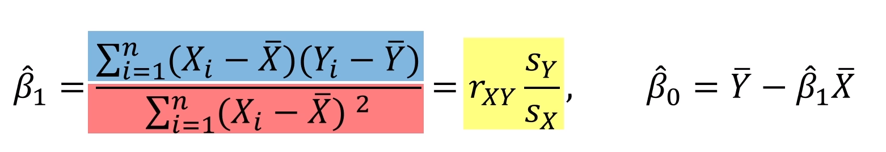

### 선형회귀

### 예측 
- 미래와 관련
- 과거의 데이터를 활용하여 불확실한 미래를 예측(prediction)
- 미래의 가능성이나 불확실성을 숫자로 게산
- 변수들의 관계를 활용

- 관심변수와 설명변수
    + 관심변수(=반응변수, 종속변수)
        * 예측의 대상이 되는 변수
        * 관심변수에 관측치간 차이가 존재
        * 다양한 방법으로 관심변수 속 차이를 확인 가능
    + 설명변수(=독립변수)
        * 관심변수 속 차이를 설명할 수있는 변수
- 수치형 관심변수와 조건부 평균 
    + 범주형 설명 변수: 그룹별 평균
    + 수치형 설명 변수: 선형 회귀

### 산점도와 추세선 이해하기
- 범주형 설명변수를 활용한 예측
    + 한 범주형 변수를 설명변수로 지정
    + 수준에 따라 그룹별 평균을 계산
    + 각 관측치의 수준을 파악해 예측에 활용 가능
- 수치형 설명변수를 활용한 예측
    + 수치형 설명변수의 구간화 
        * 수치형 설명변수의 구간화를 통한 그룹별 평균 계산  가능
    + 산점도와 상관계수의 활용
        + 산점도
        + 상관계수
> 아빠키-아들키 (구간을 잘게 나누어 각 그룹의 평균을 측정하니까 직선의 형태를 이룬다.)

### 일차함수와 추세선
- 일차함수
    + y = a + bx 
- 추세선
    + 두 변수의 상관관계를 알 수 있다.

### 선형 회귀 모형 이해를 위한 표기법 정의
- y : 수치형 관심변수(종속변수)
- x : 수치형 설명변수(독립변수)
- b0, b1 : 회귀 계수(regression coefficient)
- e : 오차(error). 랜덤으로 정해지는 설명할 수 없는 부분

### 선형 회귀 모형의 개념
- 단순 선형 회귀(simple linear regression)
    + 수치형 관심변수를 수치형 설명변수의 정비례로 설명하는 모형
        * y = b0 + b1x + e
    + X가 1씩 커질 때마다 Y는 b만큼 비례해서 변화
    + 단, Y에는 X로는 설명할 수 없는 오차 e가 존재
- 설명변수 X와 회귀계수를 활용해서 관심변수 Y를 예측 가능

### 선형회귀모형의 적합
- 두 변수 X와 Y의 관계식을 확인하는 과정
- X와 Y의 관계를 가장 잘 설명하는 식

### 회귀 계수를 계산하고 예측에 활용하기
- 산점도와 추세선

### 최소 제곱법(least squares method)를 활용
- X가 평균정도 일때는 Y도 평균정도로 예측
> 따라서 모든 회귀직선은 무게 중심(x1,y1)을 지남
- 추정된 회귀게수 b0, b1와 x를 활용한 예측값과 실제 값 y의 전반적인 차이가 적음
> 최적의 직선의 기울기 b1을 찾는다.

### 회귀
- X가 꽤 커도 Y는 생각보다 작게 예측
- X가 꽤 작아도 Y는 생각보다 크게 예측
- 예측된 Y값이 평균으로 당겨지는 효과

### 더 나아간 모형
- 더 많은 설명 변수를 활용한 회귀모형
- 의사결정나무 모형 등 활용 가능

