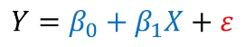
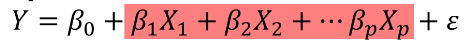

### 기술 통계와 추론 통계
1. 기술 통계(descriptive statistics)
- 변수의 특성이나 변수 간 관계를 숫자나 그래프로 표현하는 과정
- 데이터 속 차이와 관계를 확인
2. 추론 통계(inferential statistics)
- 표본으로 모집단의 특성을 유추하고 통계적 유의성을 확인하는 과정
- 데이터 속 차이와 관계를 설명

### 확률 모형의 특성
- 확률모형(probavility model)
    + 기술 통계와 추론 통계로 얻은 차이나 관계에 대한 정보를 활용
    + 변수의 특성과 변수간 관계를 활용하여 관심있는 확률을 계산
- 시점의 비교
    + 기술 통계, 추론 통계: 과거, 현재 중심의 설명
    + 확률 모형: 과거, 현재를 바탕으로 미래를 예측

### 사실과 예측(현재를 기준으로 과거와 미래를 구분)
1. 과거: 이미 결과를 알고 있는 사실
2. 미래: 결과를 알 수 없는 예측의 대상

### 심슨의 역설
- 어떤 집단의 모든 부분에서 상대적으로 확률/평균이 높아도 전체 확률/평균은 오히려 작은 현상
- 그룹별 확률/평균 차이와 집단별 선호 그룹의 차이로 발생

### 기업데이터와 조건
- 많은 사용자의 다양한 변수로 구성된 데이터
- 관심사를 설명하고 활용하기 위한 복잡한 조건 활용 필요

### 확률 모형의 이해
- 오차(error): 확률 모형에서 설명변수로 설명할 수없는 관심변수의 차이
- 예측과 불확실성

### 선형 회귀의 이해
- 단순선형회귀(simple linear regression)
    + 수치형 관심변수를 수치형 설명변수의 정비례로 설명하는 모형
    + 일차함수와 추세선
    
- 다중선형회귀(multiple linear regression)
    + 관심 변수 Y를 p개 설명 변수로 설명
    
- 선형(linear)
1. 관심변수와 설명변수는 정비례
2. 설명 변수는 서로 영향을 미치지 않음(설명변수는 서로독립)

