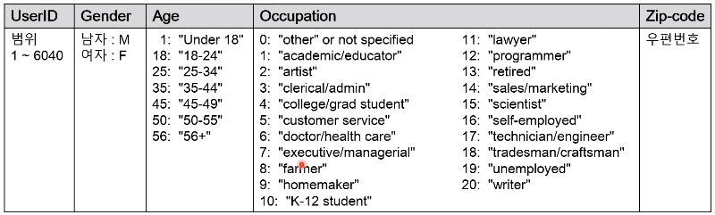
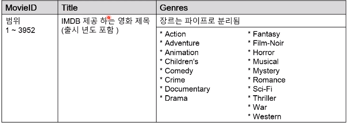
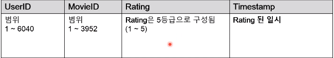
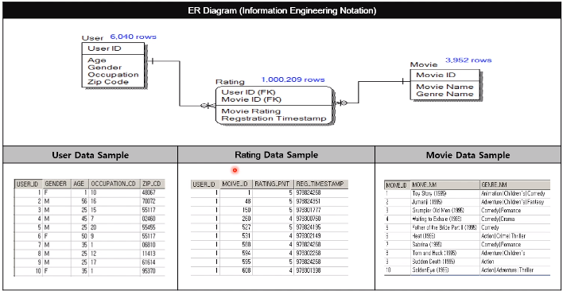

### 데이터 구조 정상화를 해야 데이터 모델에 이름(Naming)을 붙일 수 있음
- 식별자 찾기
- 참조키 찾기
- 컬럼 값 범위 점검

### 식별자 찾기
- 식별자 찾기는 고유한 컬럼 조합을 찾는 과정임
- 가이드라인
    + 컬럼 수 작은 것부터 수행(공집합은 제외)
    + 마지막 컬럼 조합까지 식별자가 없다면? -> 1정규화 위반

### 참조키 찾기
- 어떤 테이블끼리 관계가 있는지 알아내는 과정임
- 가이드라인
    + 식별자 찾기 이후에 진행
    + 성능 개선을 위해 최근 일자로 조회할 수 있음

### 컬럼 값 범위 점검 
- 컬럼은 그 컬럼에 해당하는 값 집합으로만 구성되어야함
- ex) 어벤져스:엔드게임, 2019 -> 어벤져스:엔드게임 / 2019 (따로 저장해야함)

### 원하는 데이터 셋 만들기
- 엑셀의 Pivoting과 유사하다
- 가이드 라인
    + 데이터 구조 정상화 이후에 진행
    + 데이터 셋은 성능이 문제되지 않는다면 추출 SQL 관리함
    + SQL이 복잡하다면 Create View로 뷰 객체로 관리할 수 있음
- ex) 나이를 10대, 20대, 30대.. 로 원하는 데이터 셋 만들기

---
 ### Movie Lens Data Set
 - DOWNLOAD 
    + [movie lens](https://grouplens.org/datasets/movielens/)  
 
 - USERS 테이블  
 
 - MOVIES 테이블  
 
  - RATING 테이블  
 
 - ERD  
 