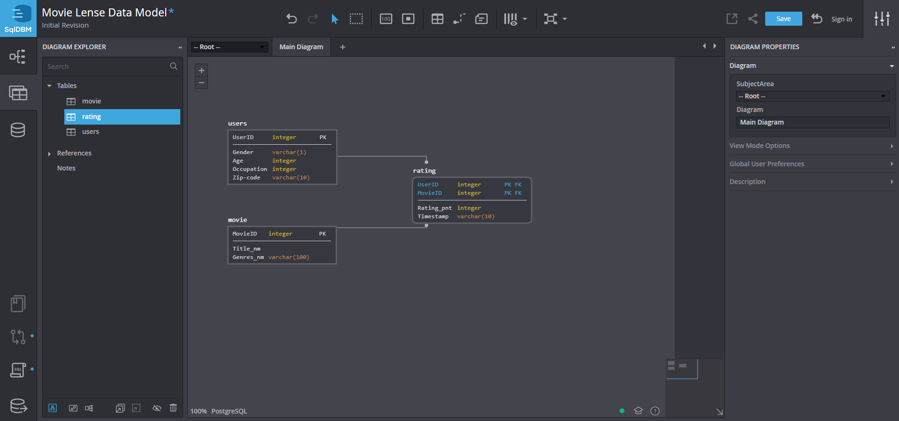
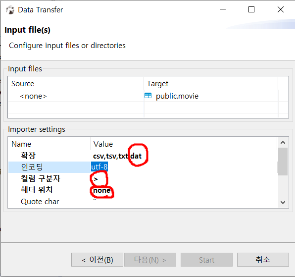

### sqldb.com
- Free로 try
- PostgreSQL로 생성(new project)
- users, movie, rating 테이블 생성  

### erd모델을 데이터베이스에 올리기
- Forward Engineer - Generate SQL
- 테이블 생성
- ~.dat 파일의 ::를 모두 >로 변경
- DBeaver에서 데이터가져오기(속성 변경)  

- 데이터 확인